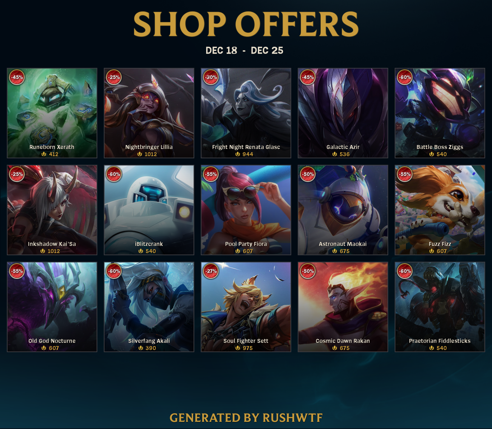

# League of Legends Shop
This project was created to test how the LCU api works.
The code is rather unprofessionalised, but simple.
## API
[LCU Docs](https://developer.riotgames.com/docs/lol#game-client-api)
## Packages
- [canvas](https://www.npmjs.com/package/canvas/v/2.11.2)
- [axios](https://www.npmjs.com/package/axios/v/1.6.2)
- [https](https://www.npmjs.com/package/https/v/1.0.0)

## Screenshots

## License
League of Legends Shop is licensed under [GNU General Public License v3.0](https://github.com/RushWTF/LeagueOfLegends-Shop/blob/main/LICENSE)
